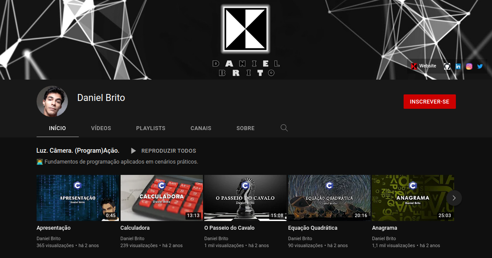

# ▶️ Canal do Youtube

Implementações de alguns dos exercícios que desenvolvo nos vídeos do meu [canal no Youtube](https://www.youtube.com/channel/UC4y3uq1d7MKDYs1LbI44Vng), inicialmente, voltado para os alunos da disciplina de Fundamentos de Programação na [Universidade Federal do Ceará](https://github.com/DanielBrito/ufc), onde fui bolsista do Programa de Iniciação à Docência.

Atualmente, além de tutoriais para iniciantes, procuro abordar temas como [programação competitiva](https://github.com/DanielBrito/competitive-programming), [programação criativa](https://github.com/DanielBrito/creative-coding-experiments) e desenvolvimento web.

